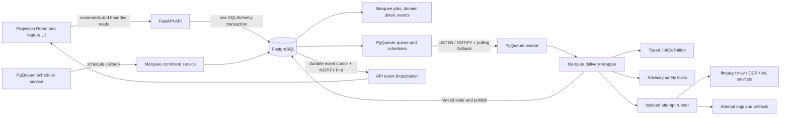

# Marquee Job System — Direct PgQueuer Adoption

**Decided:** 2026-07-12
**Status:** Target architecture; PgQueuer 1.1.1 is selected
**Supersedes:** The runtime bake-off and replaceable-runtime recommendation in
[the earlier redesign](job-system-redesign.md)
**Companion documents:** [current-state review](job-system-current-state-review.md),
[Projection Room redesign](projection-room-job-experience-redesign.md), and
[migration program](job-system-pgqueuer-migration.md)
**Progress contract:** [job progress and loading experience](job-progress-and-loading-experience.md)
**Reset-window companion work:** [miscellaneous fixes](job-system-miscellaneous-reset-window-fixes.md)
**First implementation plan:** [JMC1 PgQueuer foundation](jmc1-pgqueuer-foundation.md)
**Canonical product plans:** [JMC2A model/configuration](jmc2a-canonical-model-and-configuration.md),
[JMC2B definitions/policies](jmc2b-definition-registry-and-policies.md), and
[JMC2C presentation/APIs](jmc2c-presentation-and-api-contracts.md)
**Safety/evidence plans:** [JMC3A execution/filesystem safety](jmc3a-execution-kernel-and-filesystem-safety.md),
[JMC3B progress/logs/artifacts/events](jmc3b-progress-logs-artifacts-and-events.md), and
[JMC3C backup/ingress/certification](jmc3c-backup-ingress-and-certification.md)
**Non-mutating job plans:** [JMC4A producers/batches/schedules](jmc4a-producers-batches-and-schedules.md),
[JMC4B library/scans/media analysis](jmc4b-library-scans-and-media-analysis.md), and
[JMC4C poster/ML/certification](jmc4c-poster-ml-and-certification.md)
**Destructive job plans:** [JMC5A mutation/artwork/maintenance](jmc5a-mutation-contracts-artwork-and-maintenance.md),
[JMC5B audio/subtitle mutations](jmc5b-audio-subtitle-mutations.md), and
[JMC5C letterbox/HDR/runtime retirement](jmc5c-letterbox-hdr-and-runtime-retirement.md)

## Decision

Marquee will adopt **PgQueuer 1.1.1 directly** as its only target queue transport and
scheduler. The finished architecture will not retain the custom dequeue/runtime driver,
Procrastinate, or a multi-runtime adapter.

This decision does not turn PgQueuer's internal queue rows into Marquee's product model.
PgQueuer owns reliable delivery. Marquee owns the meaning, safety, evidence, and user
experience of a media job.

The practical boundary is:

> PgQueuer decides when and where a delivery is attempted. Marquee decides what that delivery
> means, whether it is safe to execute or retry, what happened to the media, and what the user
> sees.

PgQueuer 1.1.1 was released on 2026-07-07. Its documented capabilities include
transactional enqueue, `FOR UPDATE SKIP LOCKED` claiming, `LISTEN/NOTIFY` wakeups with a
polling fallback, deferred execution, database retry, heartbeat recovery, schedules, global
entrypoint concurrency, completion tracking, Prometheus metrics, tracing, and failed-job
holds. [PgQueuer package and transactional enqueue](https://pypi.org/project/pgqueuer/),
[performance and production guidance](https://janbjorge.github.io/pgqueuer/guides/performance-tuning/),
[release history](https://github.com/janbjorge/pgqueuer/releases)

## How this changes the previous redesign

The earlier staged-hybrid recommendation remains useful for its canonical job model,
fencing, process safety, bounded observability, and migration rules. These decisions change:

| Earlier recommendation | Direct-adoption decision |
|---|---|
| Bake off PgQueuer, Procrastinate, and hardened custom driver | PgQueuer 1.1.1 is selected; integration defects are fixed rather than used to select another runtime |
| Maintain a replaceable runtime protocol | Maintain one narrow `PgQueuerGateway`, without alternate implementations |
| Use an outbox to remain transport-portable | Enqueue the product job and PgQueuer ticket in the same PostgreSQL transaction |
| Keep the custom driver as a possible final state | The approved clean development reset gives it no schema or runtime authority; delete its code after the last handler migrates |
| Marquee owns canonical attempt leases and recovery | PgQueuer owns delivery heartbeat/recovery; Marquee keeps a non-authoritative execution audit and fence |
| Normalize a general weighted resource broker | Use coarse PgQueuer execution classes plus small advisory-lock safety gates |

The implementation remains chunked for media-safety verification, but it is now a clean-slate
database cutover rather than an expand/backfill/contract or dual-runtime deployment. See the
[six-chunk program](job-system-pgqueuer-migration.md).

## Ownership boundary

### PgQueuer owns

PgQueuer is authoritative for transport mechanics:

- queue, schedule, completion-log, and statistics schemas;
- queue schema installation and upgrades;
- ticket insertion, priority, `execute_after`, and deduplication;
- dequeue, row locking, picked state, acknowledgement, and failed holds;
- `LISTEN/NOTIFY` wakeups and fallback polling;
- transport attempt count and heartbeat;
- stale picked-job recovery and redelivery;
- persistence and timing of retries requested by Marquee;
- cron evaluation and schedule coordination;
- database-wide concurrency per registered entrypoint;
- queue-cancellation notification and worker-loop shutdown;
- transport-level Prometheus metrics, tracing, and completion records.

Marquee must not recreate PgQueuer's claim query, schedule cursor, worker delivery heartbeat,
stale-delivery sweep, queue retry timer, or queue resource reservations.

### Marquee owns

Marquee remains authoritative for product and media semantics:

- canonical string `job_id`, definition and payload version;
- dispatch generation and the current/historical PgQueuer ticket links;
- idempotency scope and correlation/parent/child relationships;
- subject identity and immutable movie/show/episode/file snapshot;
- planned/confirmed state for destructive operations;
- user intent (`run`, `pause`, or `cancel`), product phase, and terminal outcome;
- typed retry classification and maximum-attempt policy;
- semantic stages, typed progress policies/snapshots, native-tool progress adapters, parent
  aggregation, events, result, and user-facing error;
- a lightweight delivery-attempt audit linked to PgQueuer's ID and attempt number;
- current fencing token and compare-and-set writes;
- process/cgroup identity, child-process tracking, cooperative cancellation, TERM/KILL, and
  orphan cleanup;
- per-file safety, maintenance exclusion, staged output, validation, and final publish;
- typed media plans, requested changes, actual changes, target outcomes, and artifacts;
- worker/node capability and telemetry records used by the Operations view;
- per-attempt logs and artifact metadata;
- all public job APIs, semantic event delivery, and Projection Room presentation.

### Shared concerns with one clear owner

| Concern | PgQueuer responsibility | Marquee responsibility |
|---|---|---|
| Identity | Numeric transport ticket ID | Canonical product `job_id`; ticket ID is an internal link |
| Attempt | Delivery count and picked heartbeat | Audit row, fence, process/log identity, semantic outcome |
| Retry | Persist and defer the requested retry | Classify failure, choose delay/max attempts, raise `RetryRequested` |
| Cancellation | Cancel queued delivery and notify a picked handler | Record user intent and prove process death before terminal cancellation |
| Failure | Hold/log failed transport ticket | Explain domain failure, affected subject/track/stage, and recovery action |
| Schedule | Evaluate cron and coordinate schedule execution | Define desired schedules and create ordinary canonical jobs |
| Concurrency | Global cap for primary entrypoint | Secondary advisory safety gates and local device selection |
| Metrics | Queue depth, throughput, completion/failure transport data | Product latency/outcome, worker/node health, media and UI metrics |
| Logs | PgQueuer's transport completion log | Full job-context Python/tool logs and user-visible attachments |

## Target topology

Production keeps API, worker, and scheduler roles separate. The scheduler is PgQueuer's
`SchedulerManager`, not Marquee's custom scheduling loop. Its callbacks enqueue ordinary
canonical jobs; they never run a maintenance handler inline.

Embedded development mode may launch the same roles as child processes. It may not call a
handler in the API process.

## Schema ownership and migration

### PgQueuer schema

- Pin `pgqueuer==1.1.1` exactly.
- Use the default **durable** schema mode. Balanced and volatile modes are prohibited.
- Let `pgq install` and `pgq upgrade` own PgQueuer tables, functions, indexes, triggers, and
  enum changes.
- Do not reproduce PgQueuer DDL in Alembic.
- Extend the existing migration service to run Alembic for Marquee, then install/upgrade the
  pinned PgQueuer schema before API/workers start.
- Run `pgq install --dry-run`/upgrade inspection in CI and rehearse upgrades against queued,
  picked, failed-held, and completed rows.
- Apply PgQueuer's documented autovacuum settings and include its table sizes in operations
  alerts.

### Canonical `jobs`

Create one canonical `jobs` table in the fresh Marquee baseline. The target row contains:

- `id`: existing canonical string identifier;
- `pgq_job_id`: unique nullable numeric transport ID; null is valid before a planned job is
  dispatched, but queued work has an active ticket;
- `dispatch_generation`: monotonically increasing generation used to reject a cancelled,
  paused, or otherwise superseded ticket;
- `type` and `payload_version`;
- versioned typed payload/request/plan/result/error documents;
- `phase`: `planned`, `queued`, `running`, `stopping`, or `terminal`;
- `outcome`: null, `succeeded`, `failed`, `cancelled`, or `dead_letter`;
- `desired_state`: `run`, `pause`, or `cancel`;
- monotonically increasing `fence_token` and current attempt ID;
- priority, scheduled/available time, idempotency key, and retry-policy snapshot;
- parent/root/correlation and subject identifiers;
- immutable `subject_snapshot` containing the display identity needed after library changes;
- compact versioned `JobProgress`, current semantic stage/subject, progress sequence and
  freshness, and lifecycle timestamps;
- `retry_of_job_id` for operator-created successor jobs.

Do not expose `pgq_job_id` as the job's public identifier.

Keep a small `job_dispatches` audit keyed by `(job_id, dispatch_generation)` with PgQueuer
ticket ID, creation/end time, and disposition. `jobs.pgq_job_id` points only to the current
active ticket. This is transport linkage, not a second lifecycle, and is required when a
paused queued job later resumes with a new ticket.

### `job_attempts`

Keep the table as a Marquee execution audit, not a second transport lease:

- canonical job ID, PgQueuer job ID, and PgQueuer attempt number;
- immutable Marquee attempt number and fence token;
- worker/node/build identity;
- phase and semantic outcome;
- admitted, started, stopping, and finished timestamps;
- process group/cgroup, host boot ID, PID, and process-start identity;
- exit code/signal and typed failure classification;
- log/artifact references and bounded execution metrics.

The table has no authority for claim selection, heartbeat expiry, or queue recovery.
PgQueuer's picked heartbeat decides redelivery. A new delivery increments the Marquee fence,
so an old attempt cannot write current state or publish output.

### Domain, event, log, and worker data

- `job_events` remains the one semantic event history.
- Replace lifecycle-bearing `MediaJob` with a 1:1 media-operation detail keyed by `job_id`.
- Omit `MediaJobEvent` and `MediaBatch` lifecycle ownership from the clean target schema.
- Add metadata for per-attempt log segments and job artifacts.
- Replace `JobWorker` with a smaller worker-node record for build, capability, readiness,
  drain state, and telemetry. It does not participate in claiming.
- Omit custom resources, reservations, schedules, and worker-recovery state from the clean
  target schema. Unreachable source code is removed after the last handler migrates.

## Transactional enqueue

PgQueuer's principal advantage here is same-database transactional enqueue. The API command
path must preserve it.

1. Open the existing SQLAlchemy transaction.
2. Validate the `JobDefinition` payload and idempotency scope.
3. Insert the canonical `Job`, optional domain detail, parent/child links, subject snapshot,
   and initial event.
4. Increment the canonical dispatch generation, obtain SQLAlchemy's documented raw driver
   connection from that same transaction, and invoke PgQueuer 1.1.1's public
   `Queries.from_asyncpg_connection(...).enqueue()` API with:
   - the selected execution-class entrypoint;
   - a payload containing only `job_id`, `payload_version`, and `dispatch_generation`;
   - priority;
   - eligible time;
   - a deduplication key derived from canonical identity/idempotency.
5. Store the returned PgQueuer ticket ID on the canonical job and dispatch audit.
6. Commit once.

If any step fails, neither product job nor transport ticket becomes visible. No outbox or
second producer connection is used.

The gateway is pinned to the public `Queries` contract in 1.1.1 and covered by a transaction
ownership contract test. The public method issues its insert on the supplied asyncpg
connection and does not commit or close that SQLAlchemy-owned connection. Marquee does not
copy PgQueuer's enqueue SQL, create a replacement database function, or add an outbox. A
future PgQueuer upgrade is blocked until fresh-install, rollback, enqueue, and
queued/picked-job upgrade tests pass.

### Planned jobs

Destructive plans remain canonical Marquee rows in `phase=planned` with no PgQueuer ticket.
Confirmation revalidates plan expiry, file signature, warnings/override, and capabilities,
then enqueues and transitions to `queued` in one transaction. Cancellation of an unconfirmed
plan is entirely a Marquee operation.

### Idempotency

Marquee idempotency remains domain-aware. PgQueuer deduplication is defense in depth, not the
only product rule.

- A repeated API command returns the existing canonical job when the requested effect and
  payload version match.
- The PgQueuer dedupe key is unique per canonical dispatch generation.
- Automatic retry reuses the same canonical job and PgQueuer ticket.
- Queued pause cancels the active ticket; resume creates a new dispatch generation for the
  same canonical job.
- Operator retry creates a successor job with `retry_of_job_id` and a new ticket.

## Typed job definitions and execution classes

Every built-in job type registers exactly one `JobDefinition` containing:

- type and payload version/model;
- primary PgQueuer entrypoint;
- maximum runtime;
- retry classifier, maximum attempts, and backoff policy;
- safety-lock requirements;
- subject snapshot builder;
- presentation family/presenter;
- progress policy, stage vocabulary, units/denominator source, aggregation strategy,
  persistence cadence, native-tool adapter, and ETA capability;
- handler and result/error schemas;
- whether side effects are read-only, staged/idempotent, or unsafe to replay.

A coverage test fails startup/CI when a handler, parent type, or media operation lacks a
definition. Clients cannot choose an entrypoint independently of job type.

### Primary execution classes

Use a deliberately small set:

| Entrypoint | Typical work | Primary cap |
|---|---|---|
| `marquee.control` | No-op and tiny orchestration callbacks | Small process-local ceiling |
| `marquee.network` | Radarr/Sonarr/TMDB/provider-heavy work | Existing network slot setting |
| `marquee.cpu` | General CPU analysis and non-media maintenance | New explicit CPU concurrency setting |
| `marquee.media_read` | Probe, scan, detect, and other sustained media reads | Existing media-read slots |
| `marquee.media_write` | Non-GPU remux, metadata, sidecar, backup, restore | Existing media-write slots |
| `marquee.gpu` | Poster/taste ML and GPU-assisted transcode/conversion | Existing GPU slots |
| `marquee.maintenance` | Globally exclusive cleanup/reset/backup work | One globally |

The class represents the primary bottleneck. Jobs with a secondary constraint acquire a
small safety gate after delivery.

## Resource and file safety without a general broker

Remove the normalized/weighted resource ledger from the target. Retain a small, auditable
advisory-lock service:

- stable 64-bit keys for media files, GPU permits, media-write permits, and maintenance;
- deterministic acquisition order;
- dedicated session-bound PostgreSQL connections;
- shared maintenance lock for normal work and exclusive lock for maintenance;
- per-file exclusive lock for every mutation;
- numbered permit locks for GPU and media-write capacities shared across entrypoint classes;
- timeout/cancellation-aware acquisition with a semantic waiting event;
- automatic database release when the owning connection closes.

No reservation table, lease renewal, capacity bootstrap, recovery sweep, or UI-facing lock
row is needed. Projection Room shows the friendly wait reason and active safety gates from
the attempt context, not a generic resource dump.

Advisory release alone does not prove a media process is dead. File-mutating children write
attempt-scoped staging output and never publish the destination themselves.

## Delivery and execution lifecycle

### Delivery start

1. PgQueuer delivers `{job_id, payload_version, dispatch_generation}`.
2. The Marquee wrapper reloads the canonical job.
3. Terminal, cancelled, stale-version/generation, or duplicate deliveries
   record the dispatch disposition and return without running.
4. A paused delivery race records the ticket consumed/cancelled and leaves the canonical job
   paused with no active ticket; resume will enqueue a new generation.
5. Acquire declared advisory safety gates while PgQueuer keeps the delivery heartbeat alive.
   This is admission wait, not a domain attempt.
6. In one short transaction, recheck generation/intent, increment `fence_token`, create the
   execution audit attempt from PgQueuer's delivery attempt, and move product phase to
   `running`.
7. Launch the isolated attempt runner and attach logging/artifact context.

All progress, events, checkpoints, result, and error writes use a compare-and-set predicate
for current attempt and fence. Progress also uses a monotonic sequence. Redelivery creates a
new fenced progress scope; late writers from the previous attempt cannot regress or finish
the canonical snapshot.

### Success

1. The handler validates all output.
2. The coordinator rechecks fence, cancellation intent, and source signature.
3. It publishes staged output atomically when applicable.
4. It commits domain result, semantic event, attempt outcome, and product terminal outcome.
5. It closes logs and safety-lock connections.
6. Only then does the PgQueuer entrypoint return successfully.

If the worker dies after Marquee commits success but before PgQueuer acknowledges it, the
redelivery observes the terminal outcome and returns without repeating the side effect.

### Retry and final failure

Marquee classifies the error:

| Classification | Action |
|---|---|
| `resource_wait` | Wait before creating an execution attempt; if explicitly deferred, record no domain failure |
| `transient` | Record attempt failure and raise `RetryRequested` with capped jittered delay |
| `permanent` | Record terminal failure and let PgQueuer hold/log the failed ticket |
| `cancelled` | Record cancellation after process death; never retry |
| `unsafe_unknown` | Quarantine subject/output and dead-letter pending reconciliation |
| `superseded` | Reject stale writes and return/no-op according to current product state |

PgQueuer's attempt field remains the transport-delivery counter. Marquee's maximum-attempt
policy counts audit attempts that actually crossed safety admission and invoked the handler;
it derives that count from attempt rows rather than owning another queue retry timer.
Admission-only deliveries therefore cannot exhaust a mutation's domain-attempt allowance.

Before raising `RetryRequested`, the wrapper records the attempt result, retry reason, and
next eligible time. A small consistency monitor compares active canonical jobs with
PgQueuer through its public repository interface and alerts/repairs missing or held
transport state. It is not a second scheduler.

Mutating work remains one automatic attempt by default until its staged/idempotent protocol
is explicitly certified.

### Pause and resume

Pause is a queue hold, not operating-system suspension of a running media process.

- Pausing planned work changes only canonical desired state.
- Pausing queued/deferred work commits desired pause first, then cancels the current
  PgQueuer ticket, records its dispatch disposition, clears the active ticket link, and
  leaves the canonical job paused. The consistency monitor completes an interrupted cancel.
- Resume transactionally changes desired state to run and enqueues a new dispatch generation.
- A delivery racing with pause performs the same consumed-ticket bookkeeping and does not
  start an execution attempt.
- A running job cannot be paused; the API offers cancellation instead.

### Cancellation

- API first commits `desired_state=cancel`, requester, reason, and request time.
- It then invokes PgQueuer's official cancellation API for the ticket. If that call fails or
  the API dies between steps, the canonical intent remains authoritative: a racing delivery
  no-ops/cancels, and the consistency monitor retries transport cancellation.
- An unpicked job becomes product-cancelled after transport cancellation is confirmed.
- A running entrypoint receives cancellation and sets the attempt's cooperative token.
- The coordinator escalates from cooperative cancellation to process-group/cgroup TERM and
  KILL on configured deadlines.
- It does not publish staging output.
- Product outcome becomes cancelled and safety gates close only after process death is
  confirmed.
- Failure to prove death leaves the attempt visibly `stopping/quarantined`, not falsely
  cancelled.

### Worker crash and stale redelivery

PgQueuer owns stale picked-job detection and redelivery. The replacement delivery advances
the Marquee fence. The old attempt can no longer update canonical data or publish output.

Each worker records process identity and runs an orphan/cgroup sweep on startup. Destructive
tools write only attempt-specific staging paths; the fenced coordinator owns final rename.
If a tool cannot follow that protocol, loss produces `unsafe_unknown` and quarantines the
subject rather than automatically retrying.

Database fencing is not described as “exactly once.” Delivery is at least once; validated
final publication is made replay-safe through fencing, staging, idempotency, and
reconciliation.

## Process and ML isolation

Media tools and unsafe Python handlers run under an attempt process session/cgroup. A single
subprocess launcher records sanitized command, PID/start identity, stdout/stderr, exit, and
signal. Direct tool launches outside it are prohibited by review/tests.

Warm ML inference remains an intentional exception to fresh-process-per-call execution.
Long-lived per-GPU/model services preload models and accept fenced requests with bounded
concurrency. They cannot update job lifecycle or publish media paths; they return immutable
results/artifacts to the coordinator. An unresponsive inference request can recycle the warm
process, trading cache warmth for termination reliability.

## Scheduling and batches

Register recurring work with PgQueuer. A schedule callback invokes the same Marquee command
service as an API route, so job/domain/ticket visibility remains atomic.

Schedule definitions specify timezone, overlap, misfire, and catch-up policy. No schedule
callback invokes an “instant” handler.

Fixed batches insert the parent, all children, and all PgQueuer tickets in one transaction.
Dynamic workflows keep an explicit open/sealed child set; a parent cannot terminalize until
sealed. Parent state is a Marquee projection over canonical children, not a PgQueuer
workflow. That projection owns stable overall completion and bounded current-subject state;
PgQueuer ticket state is never used as a substitute for semantic batch progress.

## Observability and Projection Room boundary

PgQueuer's dashboard, log, statistics, and metrics are operator transport tools. They do not
replace Projection Room.

Projection Room reads Marquee's bounded product APIs. The Operations tab may display
translated PgQueuer queue depth, oldest age, retry/failed counts, throughput, listener
health, and scheduler health. It never presents raw queue tables as the product lifecycle.

Marquee's semantic events use one durable cursor. One tailer per API instance listens for a
notification hint, reads each event once, and fans it out to clients. PgQueuer notifications
remain private to its queue manager.

The complete job-specific UI, log, artifact, and raw-data contract is defined in
[the Projection Room redesign](projection-room-job-experience-redesign.md). Measurement,
nested overall/current scopes, persistence, and refresh recovery are defined in
[job progress and loading experience](job-progress-and-loading-experience.md).

## What Marquee no longer maintains

The fresh target baseline and final source tree omit:

- custom claim/poll/lookahead SQL;
- custom queue heartbeat and stale-attempt recovery;
- resource reservation capacity/lease tables and bootstrap;
- custom delayed-retry scheduling;
- custom recurring schedule cursor and scheduler loop;
- custom worker queue-liveness rows;
- process-local job fan-out streams;
- `create_and_run()` and every API/scheduler inline handler path;
- `MediaJob` lifecycle/cancellation/attempt/progress/event duplication;
- `MediaBatch` lifecycle duplication;
- multi-runtime adapter, outbox, bake-off, and fallback code.

## What Marquee must continue maintaining

Direct adoption still requires product-specific engineering:

1. PgQueuer schema/version integration and its narrow gateway.
2. Typed job definitions, payload/result versions, and retry classification.
3. Canonical product jobs, domain details, events, and parent projections.
4. Fenced attempt wrapper and compare-and-set transitions.
5. Advisory file/maintenance/device safety locks.
6. Process/cgroup supervision and staged media publication.
7. Warm ML services and capability/readiness reporting.
8. Logs, artifact storage, retention, and redaction.
9. Typed progress service, tool adapters, parent projections, and durable active-job
   discovery/reconciliation.
10. Presentation registry, bounded APIs, broadcaster, Projection Room, and Operations view.
11. Transport consistency monitoring and PgQueuer upgrade tests.

This is materially smaller than owning a durable queue runtime. It is also the portion a
generic queue cannot safely provide for Marquee.

## Baseline runtime configuration

Use conservative initial settings and tune only after the migration load tests:

- PgQueuer 1.1.1, durable mode;
- direct asyncpg connection for each queue/scheduler listener;
- a separately budgeted producer/admin pool;
- `heartbeat_timeout` of 60 seconds;
- `dequeue_timeout` of 10 seconds as the polling fallback;
- small dequeue batches appropriate for long-running work;
- `on_failure="hold"` for inspected failures;
- database-wide concurrency from the configured execution-class caps;
- listener-failure shutdown enabled so Compose restarts an unhealthy manager;
- PgQueuer-recommended partial indexes and autovacuum settings;
- explicit deployment-wide PostgreSQL connection budget.

These are starting defaults, not untested performance promises. Chunk tests establish the
safe values for the deployed worker count.

## Risks and controls

| Risk | Control |
|---|---|
| PgQueuer 1.x schema/API change | Exact pin, public gateway only, dry-run inspection, queued/picked upgrade rehearsal |
| SQLAlchemy/PgQueuer transaction mismatch | Invoke public `Queries.enqueue()` through the same session's documented raw asyncpg connection; prove commit/rollback ownership and connection lifetime |
| Product/transport state drifts after handler crash | Terminal-before-return ordering, idempotent redelivery, public-API consistency monitor |
| PgQueuer cancellation is only transport-level | Marquee owns cooperative token, process-group escalation, and death confirmation |
| Coarse classes underutilize hardware | Start safe; measure queue waits before adding another class or permit |
| Coarse classes miss a shared constraint | Ordered advisory GPU/media-write/file/maintenance safety gates |
| Advisory lock releases while an orphan child runs | Attempt staging, fenced coordinator publish, cgroup/process sweep, quarantine on uncertainty |
| Failed tickets and completion logs grow | PgQueuer table monitoring/autovacuum plus aligned 30-day retention |
| Library metadata changes erase historical meaning | Immutable subject and request/plan snapshots on canonical job |
| Progress resets, lies, or disappears after reconnect | Typed overall/current scopes, server-computed units, fenced sequences, durable discovery, and snapshot repair |
| Intermediate code accidentally starts the old executor | Clean target schema has no legacy runtime authority; old startup hooks stay disabled and static/runtime gates prove one executor per definition |

## Acceptance criteria

The architecture is implemented only when:

- new jobs and PgQueuer tickets commit or roll back together;
- no new job type uses the custom dequeue path;
- every built-in type has a typed definition, retry policy, safety declaration, and
  presenter plus an explicit progress policy;
- overall progress is monotonic, current progress resets only with a new scope, and opaque
  work remains honestly indeterminate;
- feature pages and Projection Room rediscover/render the same server-backed active state
  after refresh or connection interruption;
- PgQueuer alone performs dequeue heartbeat, stale redelivery, retry timing, and schedules;
- a stale delivery cannot write canonical state or publish a destination;
- cancellation confirms process death before normal release;
- fixed batches cannot be observed partially;
- Projection Room needs no raw PgQueuer table access;
- the fresh target schema contains no custom queue/resource/schedule or legacy media
  lifecycle tables;
- the final fault/media/UI certification in
  [the migration program](job-system-pgqueuer-migration.md) passes.
