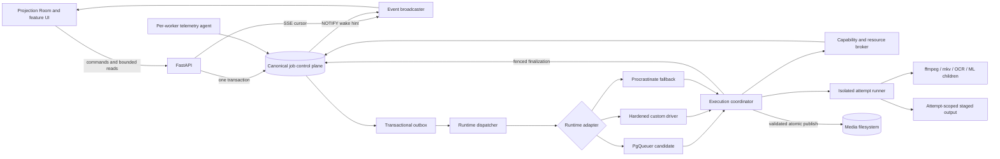

# Marquee Job System — Recommended Redesign

**Reviewed:** 2026-07-11  
**Status:** Historical recommendation; runtime-selection decision superseded 2026-07-12  
**Companion documents:** [current-state review](job-system-current-state-review.md) and
[runtime comparison](job-system-runtime-comparison.md)

## Supersession notice

Marquee has selected PgQueuer 1.1.1 directly and will not retain a custom-runtime fallback,
Procrastinate fallback, multi-runtime adapter, or bake-off. The current target is defined by:

- [direct PgQueuer adoption](job-system-pgqueuer-direct-adoption.md);
- [Projection Room job-specific redesign](projection-room-job-experience-redesign.md);
- [Projection Room activity comparison](projection-room-activity-comparison.md);
- [six-chunk clean-slate migration program](job-system-pgqueuer-migration.md).

The analysis below is retained as historical rationale. Its canonical product model,
fencing/process-safety, bounded observability, and expand/migrate/contract principles remain
useful unless the newer documents explicitly replace them. Its runtime bake-off, outbox,
replaceable adapter, and permanent custom/Procrastinate fallback are no longer current.

## Executive decision

Adopt **Option B: one canonical Marquee control plane with a replaceable PostgreSQL runtime
adapter**. Do it in stages, not as a big-bang queue replacement.

The order matters:

1. First remove the duplicate media lifecycle and close the current safety holes.
2. Establish one execution coordinator, one attempt lease/fence model, and one process
   isolation boundary.
3. Put dispatch, delayed delivery, and recurring schedules behind a small runtime interface.
4. Select PgQueuer only if it beats the hardened custom driver in destructive testing.
   Keep Procrastinate as the fallback candidate.
5. Leave Projection Room on Marquee-owned tables and APIs regardless of the selected
   transport.

PgQueuer is the preferred candidate, not a prerequisite for the redesign. If no library
passes the fault-injection gates, keep the custom driver behind the same adapter rather than
accepting weaker media-safety semantics. Do not introduce Celery, Dramatiq, ARQ, or Temporal
now. Consider DBOS only as a later, deliberate rewrite of durable multi-stage workflows.

The central architectural decision is therefore not “PgQueuer versus custom.” It is:

> Marquee owns exactly one product job, attempt, event, resource, and cancellation model.
> A queue runtime may deliver execution tickets, but it never becomes a second product
> lifecycle.

## Why this is the recommended path

Option A, a full custom-runtime rewrite, can meet every requirement but leaves Marquee
permanently responsible for generic dequeue, wakeup, retry, scheduling, and recovery
machinery. Option C, a durable-workflow rewrite, addresses stage orchestration but changes
too many variables while the current lifecycle and process-safety foundations are still
inconsistent.

The staged hybrid has the best risk boundary:

- it preserves Marquee's valuable GPU, disk, transcode, maintenance, and per-file policy;
- it removes the `Job`/`MediaJob` split before introducing a library's internal tables;
- it makes library adoption reversible;
- it improves correctness and Projection Room even if the runtime never changes;
- it allows non-mutating work to canary before destructive media jobs;
- it keeps PostgreSQL as the only mandatory stateful infrastructure.

This is not an argument for thinly wrapping the current bridge. The current safety defects
must be fixed below the handler boundary, so every transport and every job type receives the
same lease, fencing, cancellation, and process guarantees.

## Non-negotiable invariants

The redesigned platform should be judged against these invariants rather than by feature
count:

1. **One identity.** A unit of user-visible work has one canonical `job_id` from planning
   through terminal retention.
2. **One lifecycle.** Status, attempts, cancellation, progress, retry, and events are never
   independently owned by a media row or a transport table.
3. **Atomic visibility.** A job, its domain detail, resource request, children, and dispatch
   intent become visible in one transaction.
4. **Current authority only.** Every state change and published side effect belongs to the
   current attempt and fencing token.
5. **No lease-free execution.** An admitted attempt begins with a non-null lease deadline;
   expiry is enforced, not merely recorded.
6. **Death before release.** Exclusive resources and file authority are not released while
   an old process tree can still mutate the target.
7. **No work in the API.** HTTP processes validate, transact, read, and stream. They do not
   run handlers, walk libraries, invoke media tools, or supervise workers.
8. **Explicit replay safety.** A task is either idempotent, fenced/transactional, or marked
   unsafe to retry automatically.
9. **One retry owner.** Marquee decides whether and when a domain attempt is retried. The
   transport implements delivery and delay without inventing a conflicting policy.
10. **Durable truth, ephemeral wakeup.** PostgreSQL rows and event cursors are authoritative;
    notifications only reduce latency.
11. **Bounded reads.** Every list, history, event, child, attempt, and log API is paginated or
    explicitly capped.
12. **Observable failure.** An operator can identify the current owner, lease, resource wait,
    process identity, retry reason, cancellation escalation, and terminal cause from durable
    data.

The platform should explicitly promise at-least-once delivery, not “exactly once” execution.
Exactly-once claims are appropriate only for a particular fenced database transition or
validated atomic publish. All other external side effects need idempotency, reconciliation,
or a declared unsafe outcome.

## Target architecture



### Control plane versus runtime

The boundary must remain strict.

**Marquee control-plane responsibilities**

- canonical job and domain records;
- desired state, lifecycle, outcome, progress, and result;
- attempt numbers and fencing tokens;
- typed retry decisions and `available_at`;
- resource requests, reservations, and worker capabilities;
- schedules as product configuration;
- parent/child aggregation and correlation;
- append-only product events and logs;
- authorization and Projection Room APIs.

**Runtime responsibilities**

- wake workers when an execution ticket is ready;
- deliver a small, versioned ticket at least once;
- provide delayed delivery and schedule ticks when selected;
- detect abandoned deliveries using its own internal mechanism;
- expose transport health and metrics;
- acknowledge or release a ticket when instructed by the coordinator.

A runtime ticket should contain only a schema version, `job_id`, dispatch generation, and a
signed or otherwise unforgeable correlation value. It must not contain mutable media plans,
resource truth, or a second retry counter. The coordinator reloads canonical state before
acting.

Transport tables are internal implementation state. They may say that a delivery is queued,
running, or failed, but those values are not returned to users and do not drive Projection
Room directly. A reconciler reports disagreements and repairs missing delivery tickets; it
does not mirror two lifecycles field by field.

There are deliberately two recovery layers with different meanings. The runtime may detect
a lost delivery heartbeat and redeliver the same dispatch generation. On every delivery,
Marquee checks canonical state before doing anything. Marquee alone decides when an admitted
attempt lease is lost, fences/terminates its process authority, and schedules a domain retry.
A transport redelivery is therefore not automatically a new attempt, and runtime automatic
task retries must be disabled or mapped to Marquee's canonical decision.

### Transactional enqueue

Every command uses an application service rather than calling a runtime directly:

1. validate a versioned payload and idempotency scope;
2. insert the canonical job and optional domain row;
3. insert resources, parent/child relationships, and the initial event;
4. insert an outbox row keyed by `(job_id, dispatch_generation)`;
5. commit once;
6. let an independent dispatcher publish the ticket idempotently;
7. mark the outbox row dispatched after the runtime confirms insertion.

If the dispatcher dies after runtime insertion but before marking the outbox row, replaying
the row must deduplicate on the canonical dispatch key. If runtime insertion fails, the job
remains durably queued and the outbox age becomes an alertable signal. This avoids both
orphan product jobs and transport-only jobs.

Where a selected runtime can share the same transaction safely, the adapter may optimize
the happy path later. The outbox remains the portable correctness mechanism and should not
be removed merely to save one short transaction.

## Canonical data model

Names below are conceptual; the migration may evolve the existing tables rather than create
all-new ones.

### `jobs`

Keep the product-level fields in one row:

- identity, type, payload schema version, priority, and idempotency key;
- subject and correlation IDs;
- parent/workflow relationship and optional `children_sealed_at`;
- lifecycle phase and terminal outcome as separate fields;
- desired state (`run`, `pause`, or `cancel`);
- `available_at`, current attempt ID, current fence token, and dispatch generation;
- compact progress snapshot, result reference, and typed terminal error;
- retry policy snapshot and attempts used;
- created, queued, started, and finished timestamps.

Do not make `paused`, `cancelled`, `failed`, and `dead_letter` competing meanings in one
loosely interpreted status field. A useful split is:

| Dimension | Values |
|---|---|
| Lifecycle phase | `planned`, `queued`, `waiting_resource`, `running`, `stopping`, `terminal` |
| Desired state | `run`, `pause`, `cancel` |
| Terminal outcome | `succeeded`, `failed`, `cancelled`, `dead_letter` |

The API may continue exposing familiar synthesized statuses during compatibility, but the
database should preserve the distinction. A pause is intent, a timeout is an attempt
outcome, and a dead letter is a terminal job outcome.

### `job_attempts`

Each admitted execution receives an immutable attempt number and monotonically increasing
fence token. Store:

- `job_id`, attempt number, fence token, runtime delivery ID, and worker ID;
- phase (`admitted`, `starting`, `running`, `stopping`, `terminal`);
- outcome (`succeeded`, `error`, `timed_out`, `cancelled`, `lost`, `superseded`);
- non-null `lease_expires_at` from the admission transaction onward;
- heartbeat, start, finish, and last-progress timestamps;
- process group/cgroup identity, host boot ID, PID, and process start identity;
- exit status, termination signal, error class, retry classification, and metrics summary.

All attempt/job mutations use compare-and-set predicates containing both the attempt ID and
fence token. A late process may append a diagnostic “stale write rejected” event, but it
cannot change progress, result, lifecycle, or resource ownership.

### `job_resources`, requests, and reservations

Normalize resource requests rather than relying solely on a JSON object. A request includes
resource name, units, scope, and acquisition phase. A reservation includes attempt/fence,
worker scope, acquisition time, lease deadline, and release reason.

Resource kinds should cover:

- global logical pools such as external-network concurrency;
- node-local capacities such as GPU slots, VRAM, CPU weight, and transcode slots;
- path/storage pools such as media read/write bandwidth;
- exclusive keys such as `media-file:{stable_file_id}`;
- maintenance fences with an explicit definition of which work they exclude.

Unknown resources are configuration errors, not implicit capacity-one pools. Capacity
changes are administrative records, not settings overwritten by every process at startup.

### Typed domain extensions

Replace lifecycle-bearing `MediaJob` with a 1:1 media operation detail keyed by canonical
`job_id`. It owns only domain data:

- operation and media-file foreign key;
- validated request and normalized execution plan;
- planned file signature, expiry, and confirmation metadata;
- tool/capability requirements;
- output/result details specific to the operation.

It does not own status, attempt count, cancellation, progress, error, events, or batch
counters. Preserve the existing safety behavior: a destructive plan must expire and its
file signature must be revalidated immediately before execution.

Poster pipeline runs and other rich domains may use the same extension pattern. Their
domain outcome must be reconciled transactionally with the canonical job outcome; a failed
pipeline run cannot return success to the job coordinator.

### Events, logs, and projections

Use one append-only `job_events` sequence for durable lifecycle facts. Event rows need a
stable cursor, job and optional attempt ID, event kind, stage, actor, small structured
detail, and timestamp. Define a controlled vocabulary such as:

- `job.created`, `job.confirmed`, `job.queued`, `job.paused`;
- `admission.waiting`, `admission.granted`, `admission.released`;
- `attempt.started`, `attempt.heartbeat_lost`, `attempt.superseded`;
- `progress.updated`;
- `cancel.requested`, `cancel.signal_sent`, `cancel.escalated`;
- `retry.scheduled`;
- `job.completed`.

Events are not arbitrary logs. Capture stdout/stderr and structured handler logs in bounded,
per-attempt chunks with sequence numbers, byte limits, redaction, and independent retention.
Large or long-lived deployments can move chunk bodies to object storage while retaining
metadata and cursors in PostgreSQL.

Build bounded read projections for active queues, resource waits, worker health, and metric
rollups. Projection Room should not recalculate every operational view by scanning raw
history on each refresh.

## Execution and resource design

### Admission lifecycle

Runtime delivery does not itself authorize execution:

1. The coordinator receives a ticket and reloads the job.
2. A duplicate, terminal, paused, cancelled, stale-generation, or not-yet-due ticket is
   acknowledged or rescheduled without running.
3. Capability routing narrows the worker pool by execution class, tool versions, GPU class,
   and mounted-path readiness.
4. In one PostgreSQL transaction, the broker locks the job/resource rows, verifies capacity,
   creates the attempt with a non-null lease, increments the fence token, inserts all
   reservations, and changes the job to running.
5. Only after that commit may the coordinator launch the isolated runner.

If resources are unavailable, do not create a fake running attempt or hold a worker slot
indefinitely. Record a bounded/coalesced wait event and next admission time, acknowledge the
current ticket, and arrange another wakeup through resource-release notification plus a
polling fallback. Fairness should age waiting work and avoid a fixed priority lookahead that
can hide runnable jobs.

The transport may provide broad entrypoint concurrency, but Marquee's broker remains the
authority for weighted combinations and exclusive file access.

### Stage-scoped resources

Most media jobs do not need network, GPU, and media-write capacity simultaneously. Typed job
definitions should declare stages and their resource vectors. The coordinator acquires a
stage lease before entering that stage and releases it after a fenced checkpoint.

Start conservatively: whole-job reservations remain valid for handlers not yet migrated.
Introduce stage acquisition only for flows with explicit, restartable boundaries. Never
trade correctness for utilization by releasing a file or write fence while an old child can
still use it.

### Worker capabilities

Workers should register durable, expiring capabilities rather than a decorative document:

- hostname/node ID, build and schema compatibility;
- supported execution classes and handler payload versions;
- CPU, memory, GPU model/driver/VRAM, and usable encoders;
- discovered tool versions;
- stable media-root mappings and read/write probes;
- local resource capacities and current telemetry;
- drain state and last heartbeat.

Routing should use a small number of understandable execution classes for transport
subscription, followed by exact validation in the resource broker. A capability mismatch is
an admission decision, not a handler crash.

### Attempt isolation and warm ML services

The worker coordinator should remain lightweight. By default, run each admitted attempt in
its own process session or cgroup and launch all media children beneath that boundary. At
minimum, record:

- process group ID;
- host boot ID;
- PID plus `/proc` start-time identity;
- cgroup identity when available;
- every direct child and its command class, with secrets redacted.

On Linux, prefer pidfds/cgroup v2 for liveness and termination; retain process-group
fallback for environments that cannot expose them. A sweeper runs on worker startup and
after coordinator failure, not only during API shutdown.

Handlers receive a scoped context containing the job ID, attempt ID, fence, cancellation
token, progress/event writer, logger, and subprocess launcher. Direct `create_subprocess_*`
calls outside the launcher should fail review. CPU work that cannot cooperate also runs
inside the attempt process rather than an API thread; ML inference uses the warm-service
exception below.

A fresh Python process for every inference call would reload models, recreate GPU contexts,
duplicate VRAM, and destroy useful batching. ML inference is therefore the intentional
exception to literal process-per-attempt execution: use a small, long-lived service or warm
worker pool per GPU/model class. It preloads the model once and accepts fenced,
attempt-scoped requests with bounded concurrency and cooperative cancellation.

The warm service is an execution dependency, not a lifecycle owner. It cannot update job
state or publish media paths directly; it returns an immutable result/artifact to the
coordinator, which rechecks the fence. Resource admission still occurs before the request.
If an inference request is unresponsive, the coordinator cancels it and may recycle the
warm process, sacrificing cache warmth for reliable termination. Model version, GPU/VRAM,
queue depth, and readiness are worker capabilities. File-mutating and untrusted tool work
continues to use the isolated attempt process.

### Filesystem fencing and publish

Database compare-and-set prevents stale database writes but cannot stop an old ffmpeg
process from writing a path. Destructive handlers should therefore:

1. read the source under the current file/resource fence;
2. write attempt-scoped staging output;
3. validate the output completely;
4. exit the tool process;
5. let the coordinator recheck the current fence and source signature;
6. atomically publish/rename the staged output;
7. commit result metadata and release resources.

The coordinator, not an untrusted child, owns the final publish step. Avoid in-place media
mutation. Staging must use the target filesystem when atomic rename is required; cross-device
copy needs a separate validated and crash-recoverable publish protocol. If a tool cannot
stage safely, its loss classification is `unsafe_unknown`: quarantine the target and require
reconciliation or operator confirmation before retry.

When a worker lease expires, mark the attempt suspect and revoke its database authority.
Do not grant a conflicting file/write attempt until the old node confirms process death or
an external fence makes further writes impossible. On a lost node with shared storage,
correctness may require quarantining that file reservation rather than maximizing
availability.

## Cancellation, timeout, recovery, and retry

### Cancellation

Cancellation is a durable request with requester, reason, time, and escalation deadline:

1. planned/queued work with no attempt becomes terminal immediately;
2. running work changes desired state to cancel and emits a notification;
3. the runner receives cooperative cancellation;
4. after the grace window, the coordinator sends `SIGTERM` to the attempt boundary;
5. after the kill window, it sends `SIGKILL`/cgroup kill;
6. the attempt becomes terminal and releases resources only after death is confirmed;
7. failed death confirmation leaves it visibly quarantined/stopping, not falsely cancelled.

Every handler and subprocess path uses the generic job/attempt identity. Media IDs never
index a process-local cancellation registry.

### Lease recovery

Admission initializes `lease_expires_at`; heartbeat renews both attempt and reservations in
one short transaction. Recovery queries expired deadlines, including any legacy nulls, and
uses row locks plus compare-and-set.

Only one elected recovery task or advisory-lock holder performs each global sweep. Normal
workers still renew their own leases and may reconcile their own children. Recovery:

- fences the expired attempt;
- requests/validates physical termination on its node;
- records `lost` or `superseded`;
- releases non-exclusive capacity after safe revocation;
- retains/quarantines unsafe file authority when death is unproven;
- applies the typed retry decision;
- emits metrics and events for every action.

A stale attempt that wakes later cannot finalize because its fence is no longer current.

### Retry ownership and taxonomy

Replace the hard-coded retryable job-type set with versioned policy on each typed job
definition. Failures are classified as:

| Class | Default action |
|---|---|
| `resource_wait` | No attempt failure; wait and wake later |
| `transient` | Retry with capped exponential backoff and full jitter |
| `permanent` | Fail immediately |
| `cancelled` | Terminal cancelled; never retry automatically |
| `unsafe_unknown` | Quarantine/dead letter pending reconciliation |
| `superseded` | Ignore stale completion; retry only if current job policy requires it |

Policy specifies maximum attempts, timeout, backoff, retryable error classes, and whether
side effects are idempotent, staged, or compensatable. Mutating media work remains one
attempt by default until it proves a safe publish protocol.

Automatic attempts remain under the same job. An operator retry of a terminal job creates a
new canonical job linked by `retry_of_job_id`; it does not erase or reopen terminal history.
For destructive work the API revalidates the plan and requests confirmation when required.

## Scheduling, workflows, and batches

Recurring schedules should create ordinary canonical jobs through the same command/outbox
path. Scheduler leadership uses an advisory lock or runtime-supported singleton mechanism.
Schedule catch-up, overlap, misfire, and timezone policies must be explicit per schedule.
There is no `instant` bypass.

All fixed batches use one transaction. For dynamically generated workflows, a parent has an
explicit open/sealed child set; it cannot terminalize while open. Dependencies are explicit
rows rather than implicit checks hidden in handlers. Parent progress is a projection over
canonical child state and is updated incrementally or asynchronously, not by repeatedly
loading an unbounded child graph.

Keep the current parent/correlation concepts, but do not require a durable-workflow framework
for ordinary batches. Revisit DBOS if workflows gain long waits, human approvals, durable
timers, branching compensation, or stage replay that becomes difficult to express safely in
Marquee's model.

## Projection Room and API redesign

Projection Room should remain Marquee's product control plane. It should become cheaper and
more accurate, not be replaced by a queue library's administration UI.

### Read APIs

Split the current unbounded detail endpoint into purpose-built reads:

- `GET /jobs?status=&type=&subject=&resource=&cursor=&limit=` — server-filtered summary;
- `GET /jobs/{id}/snapshot` — compact current state, active attempt, progress, and wait
  reason;
- `GET /jobs/{id}/attempts?cursor=&limit=`;
- `GET /jobs/{id}/events?after=&limit=`;
- `GET /jobs/{id}/children?cursor=&limit=`;
- `GET /jobs/{id}/logs?attempt=&stream=&after=&limit=`;
- bounded, pre-aggregated metrics/history endpoints with server-side resolution.

The existing `/api/jobs` and `/api/media-jobs` contracts can adapt to these reads during
migration. The media list must join through an indexed 1:1 foreign key, never scan JSON
payloads per row.

### Event delivery

Use one broadcaster per API instance:

1. a PostgreSQL trigger/application write emits `NOTIFY` containing only the newest durable
   event cursor;
2. the broadcaster tails `job_events` once and fans out in memory to local clients;
3. every SSE item carries the durable event ID;
4. reconnect honors `Last-Event-ID` and queries the durable gap;
5. periodic low-frequency polling closes missed-notification gaps;
6. slow clients receive bounded buffers and reconnect rather than consuming unbounded RAM.

Provide a multiplexed account/session stream when a page tracks many jobs. The database
load should be roughly constant per API instance, not one 0.5-second query loop per browser
and job. Remove the unused cross-process listener maps or make them private implementation
details of this broadcaster.

The frontend should use the stream for deltas and a low-rate snapshot reconciliation for
correctness. It should not simultaneously fetch full history every 1.5 seconds. Pause hidden
tab work, abort superseded requests, prevent overlapping intervals, and fetch expensive
panels only while visible.

### Metrics and host telemetry

Current metrics must come from cached samples, not synchronous `psutil`, `/proc`, sensor, or
NVML collection in an HTTP request. Each worker/node reports its own telemetry and
capability health; API-host telemetry is labelled separately.

Pre-aggregate long windows to a bounded point count. A 24-hour graph should not deserialize
all raw 15-second samples every four seconds. Retain raw samples briefly, hourly/daily
rollups longer, and job events according to audit policy.

Separate metrics from events and logs. At minimum export:

- enqueue, queue-wait, admission-wait, runtime, and end-to-end latency histograms;
- jobs and attempts by type/outcome/retry class;
- active, due, and oldest-age gauges for queue, outbox, recovery, and dead letters;
- lease expiry, stale completion, cancellation, TERM/KILL, and orphan-process counters;
- resource capacity, reserved units, waiters, and wait duration;
- worker heartbeat, drain, capability mismatch, and build-version gauges;
- event broadcaster lag and connected/slow clients;
- database pool use, query latency, lock timeout, and transaction age by process role.

Attach `job_id`, `attempt_id`, fence, worker, and correlation context to structured logs and
OpenTelemetry spans. Do not use high-cardinality job IDs as Prometheus labels.

## Protecting API responsiveness

The API, dispatcher, scheduler, execution coordinator, and telemetry collectors run as
separate roles in production. Embedded mode may remain a developer convenience, but it must
spawn the same roles and may not call handlers inline.

Additional boundaries:

- give queue-control transactions and user-facing reads explicit, separately budgeted
  connection pools;
- cap total PostgreSQL connections across process replicas rather than configuring each in
  isolation;
- use short transactions and per-role statement/lock/idle-transaction timeouts;
- cache or project expensive dashboard aggregates;
- rate-limit control storms and coalesce progress snapshots;
- bound handler event frequency and log volume;
- isolate attempt CPU, memory, and process counts with cgroups/container limits where
  available;
- surface degraded dispatcher/scheduler/recovery health instead of silently accumulating
  work.

Process separation alone cannot protect the API from shared disk, memory, GPU, or database
exhaustion. Resource policy and connection/query budgets must cover the whole deployment.

## Proposed module boundaries

A possible destination layout is:

```text
marquee/core/jobs/
  application.py       # create, confirm, cancel, pause, retry commands
  definitions.py       # typed payloads, retry/resource/stage policy
  state_machine.py     # validated canonical transitions
  admission.py         # capability routing and resource transactions
  coordinator.py       # attempts, leases, cancellation, finalization
  processes.py         # attempt runner, child tracking, TERM/KILL, orphan sweep
  inference.py         # long-lived fenced GPU/model execution pools
  events.py            # durable events and notification outbox
  projections.py       # bounded queue/metrics read models
  recovery.py          # elected expiry and reconciliation sweeps
  runtime/
    base.py             # narrow dispatch/schedule/health protocol
    custom.py           # current driver after hardening
    pgqueuer.py         # candidate adapter
    procrastinate.py    # fallback adapter/bake-off implementation
marquee/core/media_jobs/
  definitions.py       # typed media request/plan/result only
  handlers.py          # handlers using the generic attempt context
```

Names can change, but dependency direction cannot: routes and media code call the
application/control-plane interface; only the dispatcher/coordinator knows the runtime.

## Migration plan

Use Alembic expand/migrate/contract changes. Never combine lifecycle unification, runtime
cutover, and destructive table removal in one release.

### Phase 0 — Contain current P0 risks

Before library work:

1. initialize heartbeat/lease at claim and recover legacy null heartbeats;
2. enforce reservation expiry and make release conditional on attempt/fence ownership;
3. prevent retry/re-admission until the prior process tree is confirmed dead;
4. add startup/crash orphan sweeps with durable process identity;
5. remove `create_and_run()` and scheduler `instant` execution from all non-trivial paths;
6. route every batch through one atomic construction transaction;
7. fix generic/media cancellation identity, missing `audio_reorder` registration, and poster
   pipeline failure propagation;
8. make manual retry idempotent and stop selecting generic jobs by JSON scan;
9. add the destructive crash/cancel tests before changing transport.

Some full fencing work needs Phase 1 schema, so Phase 0 may be delivered as two expand-safe
releases. The release gate is that the known claim-start and leaked-process wedges no longer
exist.

### Phase 1 — Expand the canonical schema

Add without dropping:

- lifecycle/outcome/desired-state separation;
- current attempt and monotonically increasing fence;
- non-null attempt and reservation lease deadlines;
- typed error/retry fields and dispatch generation;
- transactional outbox;
- process identity/cgroup fields;
- indexed 1:1 media detail-to-job foreign key;
- legacy ID mapping and `retry_of_job_id`;
- event cursor and bounded log tables;
- capability/resource normalization needed by the broker.

Backfill media links from `payload.media_job_id`. Flag zero-to-one and one-to-many anomalies
for repair rather than choosing silently. Preserve old IDs in a mapping table so bookmarks,
API clients, and historical audit references continue to resolve.

### Phase 2 — Make canonical state the only writer

Move create, confirm, cancel, progress, terminalization, retry, and batch aggregation behind
the application/state-machine service. Media handlers write domain details and canonical
events in the same transaction where appropriate.

Keep legacy media endpoints as compatibility adapters that synthesize their DTOs from the
canonical job plus media detail. Stop writing media lifecycle/event/batch fields. Add a
consistency auditor and run it in report-only mode before and after each rollout.

Switch Projection Room and feature job tracking to bounded canonical endpoints and the new
event broadcaster. This reduces load before the transport experiment and makes transport
changes invisible to the frontend.

### Phase 3 — Install the execution safety boundary

Introduce the coordinator/attempt-runner split, CAS fencing, physical cancellation,
attempt-scoped staging, and the new resource broker while still using the custom dispatch
driver. Migrate handlers in risk order:

1. no-op/test and read-only maintenance;
2. network/sync and non-mutating scans;
3. poster compute with staged outputs;
4. subtitle generation and restore;
5. re-encode and other destructive media mutation last.

Legacy handlers that cannot yet stage safely remain one-attempt and whole-job-reserved.

### Phase 4 — Runtime bake-off and selection

Implement the same narrow adapter for the hardened custom driver, PgQueuer, and, if needed,
Procrastinate. Run the destructive suite in the
[comparison](job-system-runtime-comparison.md#required-bake-off) against production-like
PostgreSQL, worker counts, media mounts, and GPU processes.

Pin exact versions and test runtime schema upgrades with queued/running tickets. Shadow mode
may mirror dispatch metadata and metrics, but the shadow runtime must never invoke a real
handler. Select PgQueuer only if it satisfies the gates below and has an acceptable upgrade
story; otherwise retain the custom adapter or use Procrastinate if it proves better.

### Phase 5 — Canary and cut over dispatch

Assign each job a durable runtime driver/generation. Exactly one driver owns an execution
generation.

- Canary new, non-mutating job types first.
- Drain existing running work in its original driver.
- Either drain old queued work or migrate it transactionally while stopped; never make it
  visible to two executors.
- Expand through read-only media, compute, then destructive mutations.
- Keep rollback able to route only not-yet-started generations back to the prior driver.
- Let already running attempts finish or be cancelled by their owning driver.

Runtime internal state is monitored alongside canonical state through the reconciler. Do not
add a UI switch that lets users choose a transport per job.

### Phase 6 — Improve utilization and retire legacy state

After correctness and cutover stabilize:

- enable stage-scoped resources for explicitly checkpointed pipelines;
- add heterogeneous-node/path routing and weighted GPU/VRAM/disk models;
- tune fair admission and event/metric rollups from measured workloads;
- drop obsolete media lifecycle/event/batch columns and tables;
- remove the bridge, JSON relationship scans, process-local streams, and inline API code;
- remove the losing runtime adapter only after a full rollback window.

Contract migrations should happen at least one release after all supported binaries stop
reading the old shape.

## Compatibility and rollout rules

1. Preserve existing public IDs through a legacy mapping and return canonical IDs in new
   fields before changing route semantics.
2. Version payloads and keep upcasters for queued jobs across at least one rolling upgrade.
3. Maintain old response DTOs through adapters; add deprecation headers/docs before removal.
4. Map media SSE to canonical durable events and honor `Last-Event-ID`; do not replay the
   entire legacy stream.
5. Treat idempotency scope as `(job definition, subject, requested effect, payload version)`
   rather than a global opaque string alone.
6. Use feature flags by job definition and worker build, not broad global dual execution.
7. Run the consistency auditor continuously during migration and alert on orphan domain rows,
   missing outbox tickets, duplicate active fences, negative resource capacity, and
   canonical/runtime disagreement.
8. Back up and rehearse every runtime/Alembic schema change with realistic table volume.

## Acceptance gates

The exact latency objectives should be confirmed against production baselines. The following
are reasonable starting release gates.

### Correctness

- Repeated crash injection at every claim/admission/start/finalize boundary produces no
  permanently claimed job or unreleased safe-to-release reservation.
- A recovered or superseded attempt cannot update canonical state or publish a destination
  file.
- No two attempts hold the same exclusive media-file fence.
- No conflicting attempt starts until prior process death or an equivalent external fence
  is proven.
- Queue, confirmation, domain detail, batch children, and dispatch intent are atomically
  visible.
- Every terminal job has a terminal attempt or an explicit no-attempt cancellation reason.
- Automatic mutation retries occur only for definitions with a tested safe publish or
  idempotency protocol.

### Recovery and cancellation

- Claim-before-start worker death is recovered within the configured lease plus one recovery
  interval.
- Queued cancellation is reflected within two seconds under target load.
- Running cancellation records cooperative, TERM, and KILL timestamps and confirms process
  death before normal release.
- Worker, child, PostgreSQL, and API restarts pass the same test matrix without manual row
  edits.
- Outbox and runtime reconciliation repair a dispatcher crash without duplicate execution.

### Performance and isolation

- API job-list/control p95 remains below 250 ms and p99 below one second at the agreed
  saturated-worker test load, or meets a stricter existing product SLO.
- Event delivery p95 is below one second without per-client database polling.
- Query count for a job snapshot is bounded independently of event, attempt, child, and log
  history size.
- A 24-hour metrics response has a fixed maximum point count and payload budget.
- Database connections remain inside an explicit deployment-wide budget when all configured
  replicas reach concurrency.
- GPU, disk, memory, and database saturation do not make health/control endpoints unusable.

### Operations

- Projection Room shows queue wait, resource reason, current attempt/fence, worker/node,
  retry decision, cancellation escalation, and bounded logs.
- Alerts cover oldest queue/outbox/recovery age, dead letters, lease losses, orphan processes,
  resource starvation, event lag, and control-plane/runtime divergence.
- Upgrade and rollback are rehearsed with both queued and running jobs.
- The selected library's migration and release cadence is reviewed and its version is pinned.

## Principal risks and mitigations

| Risk | Mitigation |
|---|---|
| PgQueuer 1.x churn or a blocking schema migration | Adapter boundary, pinned version, staging upgrade rehearsal, custom/Procrastinate fallback |
| Product/transport divergence | Transactional outbox, unique dispatch generation, idempotent insert, continuous reconciler |
| False confidence from database fencing | Staged output, coordinator-owned publish, process death proof, quarantine unsafe work |
| Migration ambiguity from JSON media links/manual retries | Backfill report, explicit legacy mapping, operator-reviewed anomaly queue |
| PostgreSQL contention after adding durable logs/events | Coalesced progress, bounded chunks, retention/rollups, connection budgets, load tests |
| Heterogeneous workers cannot access the same paths/tools | Expiring capabilities, stable path mappings, active readiness probes, admission validation |
| Two retry engines replay side effects | Marquee owns retry classification; adapter disables/maps library retry policy |
| Rollback creates dual execution | Durable driver/generation ownership; running work stays with original driver |
| Stage-scoped release races with children | Whole-job default; only migrate checkpointed stages with fenced process boundaries |

## If rewriting Marquee today

I would still choose PostgreSQL as the system of record and build the product around one
typed job model, a transactional outbox, immutable attempts with fence tokens, normalized
resource reservations, and a durable event cursor. I would use PgQueuer for ticket delivery,
wakeup, and delayed scheduling only after its fault suite passed; otherwise I would keep a
small `SKIP LOCKED` driver behind the same interface.

Every handler would execute behind an isolated attempt boundary, every external process
would be launched through one tracked API, and every destructive media operation would write
staged output that only the fenced coordinator could publish. GPU inference would use a
small warm service/pool that cannot own lifecycle or publish side effects. The web
application would never run a handler. Media plans would be 1:1 domain details, not jobs of
their own.

Projection Room would be designed at the same time as the control plane: compact snapshots,
cursor-based durable events, paginated attempts/logs/history, cached rollups, and per-worker
telemetry. That gives the system one understandable story from user command to process tree
to terminal audit, while keeping the runtime replaceable if Marquee later needs DBOS-style
durable stages or Temporal-scale distributed orchestration.

## Final recommendation

Approve the staged Option B architecture and begin with Phase 0 and Phase 1. Treat runtime
selection as a measured Phase 4 decision, not the first implementation task. The first
success criterion is not “PgQueuer is running”; it is that Marquee has one canonical job and
cannot release or replay unsafe work while an old attempt still has authority.
